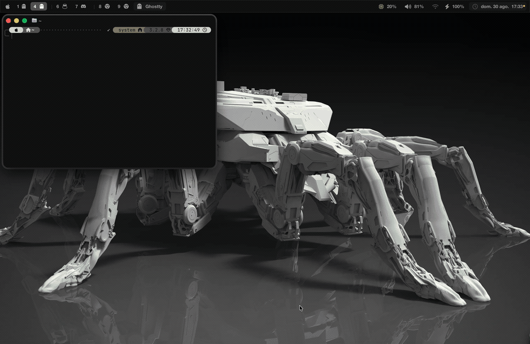

# artheme

Omarchy-style themes for macOS. One `colors.toml` per theme drives the
terminal, the status bar, the window borders, the desktop wallpaper and the
system light/dark mode — all of them, in one command.

```bash
theme osaka-jade
```

[Omarchy](https://omarchy.org) does this on Linux, and it is the nicest part of
using it: themes are data, not a pile of per-app config. This is a small port
of that idea to a macOS setup. No code is shared with Omarchy — but its theme
format is, so most Omarchy themes work here unmodified.



## What changes when you switch

Every integration is optional and auto-detected: whatever you do not have is
skipped. `artheme doctor` says what it found.

| App | How | Live? |
|---|---|---|
| **Ghostty** | generated config, included from yours | yes, `SIGUSR2` |
| **kitty** | generated config, `include`d from yours | yes, `SIGUSR1` |
| **Alacritty** | generated toml, `import`ed from yours | yes, it watches the file |
| **WezTerm** | a colour scheme in `colors/artheme.toml` | yes, it watches the directory |
| **iTerm2** | a Dynamic Profile named Artheme | yes, once you pick the profile |
| **SketchyBar** | generated palette, `source`d from `colors.sh` | yes, `--reload` |
| **JankyBorders** | generated `bordersrc`, process restarted | yes |
| **herdr** | its `[theme.custom]` block, rewritten surgically | yes, reloads over its socket |
| **Wallpaper** | every Space and display repointed | yes |
| **Light/dark mode** | the system setting follows the theme | yes |
| **VS Code** | a local theme extension | pick it once, reload the window |
| **Neovim** | `~/.config/nvim/colors/artheme.lua` | `:colorscheme artheme` |
| **Zed** | `~/.config/zed/themes/artheme.json` | pick it once |
| **btop** | `~/.config/btop/themes/artheme.theme` | on next start |
| **tmux** | generated conf, `source-file`d from yours | yes, sourced live |

Colours are derived from the theme's own palette, not copied from files a theme
may or may not ship — so all of this works with any Omarchy theme, including the
ones whose repositories carry nothing but a `colors.toml`.

Chromium is deliberately absent: Omarchy themes it through a Linux-only flag
that has no macOS equivalent.

## Install

Download `Artheme.app` from the
[latest release](https://github.com/spunzon/artheme/releases/latest), drag it
to Applications, open it. It is not notarised
yet, so the first time macOS will say the developer cannot be verified: go to
**System Settings → Privacy & Security** and press **Open Anyway**.

It ships with 24 themes — their colours and a 35 KB cover each — and copies
them into `~/.config/artheme/themes` the first time it runs. Wallpapers are not
included: the app fetches the ones belonging to a theme in the background the
first time you apply it, and a theme with no picture at all gets a cover drawn
from its own palette. Nothing else is required — no Python, no Homebrew, no
runtime of any kind.

Then, once:

```
artheme install       # wires up whatever apps you have
artheme doctor        # check what it found
```

The app checks GitHub for a newer release once a day and shows a banner when
one is out — press **Actualizar** and it downloads, replaces itself and
relaunches, no browser round-trip. **App → Check for Updates…** does the same
on demand. There is no appcast or signing key: it fetches the same ad-hoc
signed zip a manual download would, over `URLSession` rather than a browser,
so it never picks up the quarantine flag that would otherwise trigger the
"unidentified developer" prompt a second time.

`artheme install` only appends: one line to Ghostty's or kitty's config, a shim
for SketchyBar's `colors.sh`, a `source-file` for tmux. Everything it takes over
is backed up as `<file>.artheme-bak`, and `artheme restore --yes` undoes all of
it.

### From source

Needs the Command Line Tools (`xcode-select --install`) and nothing else:

```bash
git clone https://github.com/spunzon/artheme ~/projects/artheme
cd ~/projects/artheme/app
./Scripts/bundle.sh            # builds Artheme.app and a zip, universal
swift run ArthemeTests         # 51 checks
```

The CLI lives inside the bundle; `artheme install-cli` puts it on your PATH.

## Usage

```bash
artheme                 # list themes, * marks the active one
artheme osaka-jade      # switch
artheme next            # rotate
artheme reload          # re-apply, after editing a colors.toml

artheme bg              # list the active theme's wallpapers
artheme bg 4            # pick by number
artheme bg louvre       # ...or by partial name
artheme bg next         # rotate

artheme doctor          # what's installed, what's wired
artheme swatch          # print the active palette
artheme restore --yes   # put every file it touched back
```

The wallpaper choice is remembered per theme. The app does the same things with
a grid, and its menu bar item switches without opening anything.

## Adding a theme

Most Omarchy themes work as-is:

```bash
artheme catalogue                        # what upstream Omarchy publishes
artheme fetch osaka-jade                 # from Omarchy itself
artheme fetch mattbbia/pissarro          # from a standalone theme repo
artheme fetch owner/repo#branch --as foo
artheme fetch batou                      # already installed → just its wallpapers
```

`fetch` pulls `colors.toml` plus `backgrounds/` (and `backgrounds-alt/`,
prefixed `alt-`), skipping any single image over 12 MB. It records where the
theme came from in `source.json`, so wallpapers can always be re-downloaded
after a fresh clone.

Doing it by hand works too: drop a `colors.toml` in `themes/<name>/` and it
shows up in `artheme list`.

### The two colors.toml schemes

Omarchy themes ship in two formats and the parser takes both:

- **Numbered** (current Omarchy, e.g. osaka-jade): `color0` … `color15`, plus
  `accent`, `cursor`, `background`, `foreground`, `selection_*`.
- **Semantic** (e.g. pissarro): `red`, `green`, `bright_blue`, `muted`,
  `mode = "light"`…

The mapping lives in `Theme.semantic` in `app/Sources/ArthemeKit`, checked
against the `ghostty.conf` pissarro's author publishes. The one colour that doesn't fall
out cleanly from the semantic scheme is `color15`; if a theme defines it
differently, add it to `colors.toml` by hand.

### How the bar colours are derived

A theme carries fewer shades than a status bar needs, so the rest are mixed out
of background and foreground:

- `BAR_COLOR` = background at 94% opacity
- `ITEM_BG_COLOR` = background mixed 8% toward the foreground
- `BAR_BORDER_COLOR` = 16%
- `FG_DIM` = 60%
- `FG_ON_ACCENT` = black or white, by the accent's luminance
- `WS_FOCUSED_BG` = the accent; `WS_VISIBLE_BG` = the accent at 25%

## Gotchas

The things that cost me an evening, so they don't cost you one.

**The wallpaper cannot be set with AppleScript.** `tell every desktop to set
picture` only reaches the *active* Space of each display — every other Mission
Control Space keeps the old picture. The only way to cover them all is to
rewrite WallpaperAgent's index:

    ~/Library/Application Support/com.apple.wallpaper/Store/Index.plist

where each `Configuration` is a binary plist `{type: imageFile, url: {relative:
file://…}}`, and then `killall WallpaperAgent`. This is a private Apple file
and it may change between macOS releases; a copy is kept as
`Index.plist.artheme-bak` the first time, and `theme restore --yes` puts it
back. *Corollary:* a Space created **after** a theme switch is born with the
system default. `theme reload` catches it up.

**Ghostty reloads on `kill -USR2`.** Its docs confirm it: keybind, menu,
SIGUSR2 or restart — there is no auto-reload on file change (as of 1.3.1). It
beats sending `Cmd+Shift+,` via AppleScript, which steals focus and needs the
Accessibility permission. And the process is `ghostty`, lowercase: `pgrep -x
Ghostty` finds nothing, even though System Events sees it as "Ghostty".

**`pgrep` cannot see its own ancestors.** This one cost the most. On macOS
`pgrep`/`pkill` exclude the calling process *and every one of its ancestors*
unless you pass `-a`. So `pgrep -x ghostty`, run from a shell inside Ghostty,
returns nothing — and the switcher silently skips the reload. The theme changes
everywhere except the terminal you typed the command in, which is the one place
you are looking. Run it from a multiplexer whose server is not a child of the
terminal and it works, which makes it look like the terminal is at fault. Parse
`ps -Ao pid=,comm=` instead; `-a` would work on macOS but means something else
on Linux.

**A theme with no `backgrounds/` leaves your desktop alone**, deliberately. A
dynamic system wallpaper has no file path, so it cannot be restored once
overwritten. Don't overwrite what you can't put back.

**`bordersrc` needs the absolute path to the binary.** It is launched by your
window manager, which does not have your user PATH.

**Glyphs from the Private Use Area get eaten by editors.** If you theme
SketchyBar icons: writing a Nerd Font glyph through some tools silently leaves
an empty string — no error, just a hole in the bar. Generate them by codepoint
(`chr(0xF2DB)`) and verify with `printf '%s' "$CPU" | xxd`.

**Upstream Omarchy moved** to `omacom/omarchy`, branch `quattro`. Old
`raw.githubusercontent.com/basecamp/omarchy/master/…` URLs 404 on binaries even
while still serving text — use the contents API's `download_url`, which is what
`theme fetch` does.

## Security

A theme is data downloaded from someone else's repository, and its values end
up in files that get executed — `bordersrc` is run by your window manager,
`sketchybar-colors.sh` is sourced by your `sketchybarrc`. So the parser treats
every value as hostile:

- **Colours must be hex.** `accent = "#ff8800$(curl … | sh)"` is refused, not
  written out. Free text such as a theme's name is stripped of `$`, backticks,
  quotes and backslashes before it reaches a generated file, and shell literals
  are quoted on the way out even after validation.
- **Downloads stay inside `themes/`.** Names from a remote listing and from
  `--as` are rejected if they contain a separator or would escape the directory.
  Downloads are https-only and capped at 32 MB.
- **`GITHUB_TOKEN` is optional and only ever sent to `api.github.com`.** It is
  dropped if a redirect leaves that host, and never attached to file downloads.
- **Everything it takes over is backed up** as `<file>.artheme-bak` (a second
  install that would overwrite different content writes a timestamped copy
  instead), and `theme restore --yes` puts it all back.

What it does *not* do: verify who wrote a theme. A wallpaper is still an image
from a stranger's repository, and `install` still edits your app configs. Read
`bin/theme` before trusting it — it is one file.

```bash
cd app && swift run ArthemeTests   # 51 checks: the core, all 15 integrations, and the updater
```

Integrations write through an injectable `Machine`, so the tests point a whole
run at a throwaway home directory and assert on what lands there — including
that a theme with hostile free text produces no file containing `$(` or a
backtick.

## What it writes on your machine

| File | What happens |
|---|---|
| `~/.config/ghostty/config` | one `config-file` line appended |
| `~/.config/sketchybar/colors.sh` | replaced by a shim |
| `~/.config/borders/bordersrc` | generated on every switch |
| `~/.config/herdr/config.toml` | only its `[theme.custom]` block |
| `…/com.apple.wallpaper/Store/Index.plist` | image entries repointed |

Each is backed up once as `<name>.artheme-bak` before the first change.
`theme restore --yes` reverses all of it.

## Recording a demo

`artheme demo` cycles themes on a timer and prints each palette in truecolor,
so every theme's row stays as printed and the sequence is legible afterwards.
Alternate light and dark themes, and don't start with the one already active —
the first switch is the one that has to land. Start a screen recording, then:

```bash
artheme demo --hold 3 batou pissarro osaka-jade
```

## Credits

Themes belong to their authors — see [CREDITS.md](CREDITS.md). The idea belongs
to [Omarchy](https://omarchy.org).

This is my personal setup, published in case it is useful. Fork it freely;
I make no promises about supporting yabai, kitty, WezTerm or anything else I
don't run.
